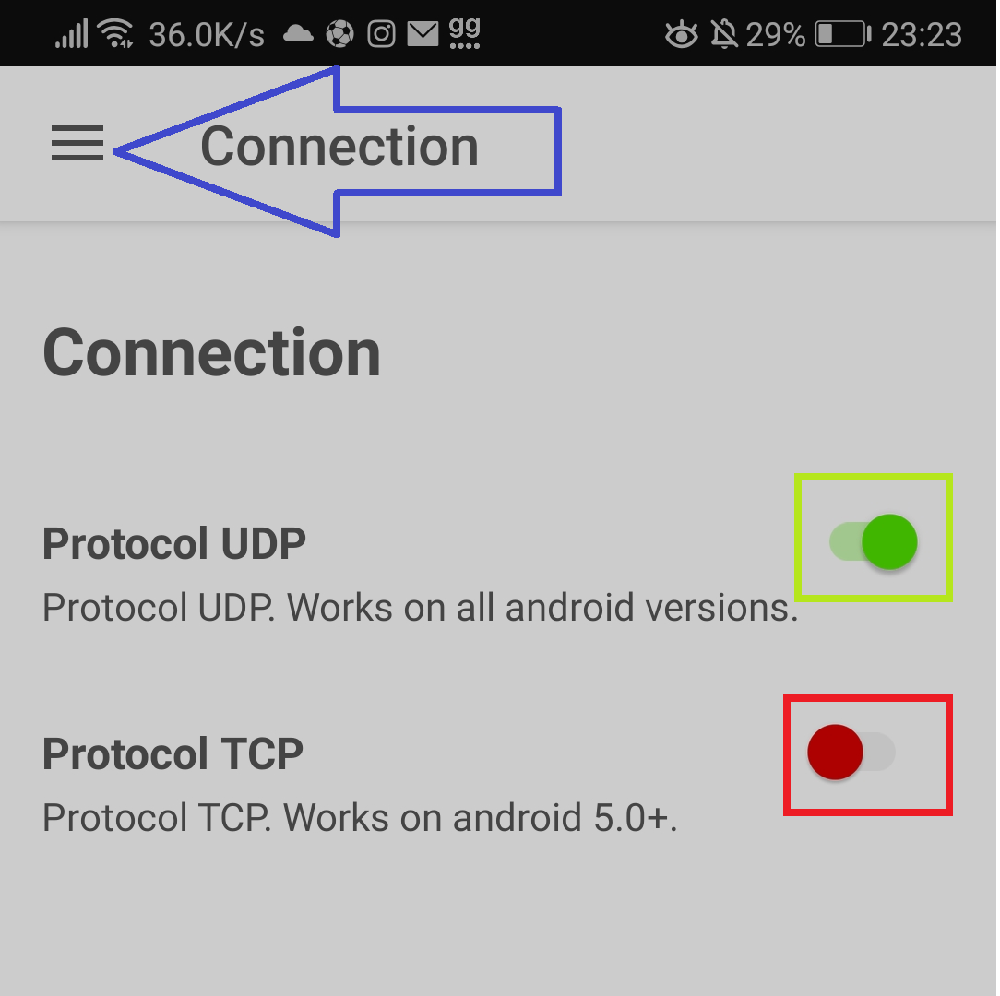
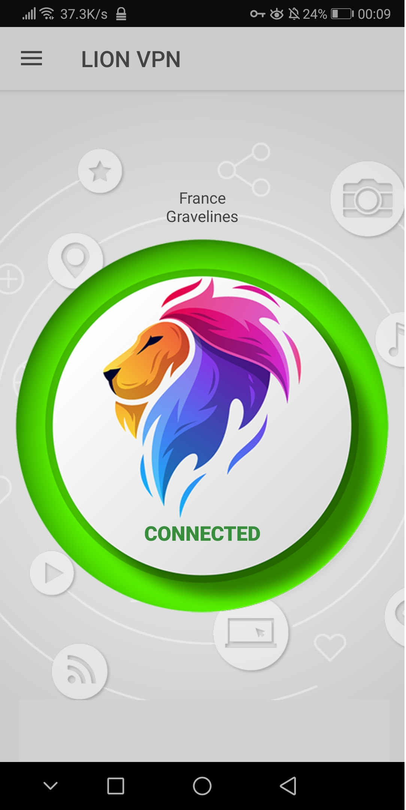

# F@tih ağına nasıl bağlanılır?
Bunun için önce VPN'ye ihtiyacımız var. Sonra da ağın şifresine.


## Adımlar:
1. Ağa bağlanın
2. VPN'yi indirip kurun
3. Hazır


## 1- Ağımıza bağlanalım: 
### Şifre:
```
!1qaz2WSX3edc4RFV%56
```

Wifi ağlarında görünün `f@tih` ağına bu şifreyle bağlanabilirsiniz.

## 2- VPN'yi indirin:
## [VPN'nin linki](https://m.apktoy.com/download/mironapp.fast.unblock.secure.proxy.free.lion.vpn_2.5_free.html)

Bu link üzerinden indirin.
Daha sonra uygulamayı kurun. Yeni sürümler kısıtlı olduğu için bu sürümü kuruyoruz.

Uygulama üzerinden `"Connection"` menüsüne girin. Ardından TCP açıksa onu UDP olarak değiştirin.



<br><br>


Herşey hazır, artık ana menüde `f@tih` ağına başarıyla bağlanmışsanız, bu tuşa basınca bağlanmaya başlayacaktır:



## Önemli notlar:
- Eğer bağlanmakta zorluk çekiyorsa, mekanlar menüsünden mekan değiştirin, en az kullanılan mekana geçin, biraz uğraştıracaktır UDP modunda bağlanmak, biraz sabredin. TCP modu hızlı fakat `@fatih` ağıyla bağlantı kuramıyor.


## İlham için Sapphireye teşekkürler :)